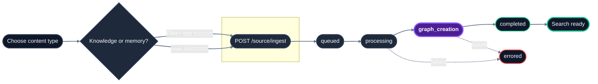

## Lifecycle



## Endpoint reference

| Endpoint | Method | SDK method | Purpose | Async? |
|---|---|---|---|---|
| `/source/ingest` | `POST` | `source.ingest` | Ingest files, app sources, or memories | Yes |
| `/source/status` | `GET` | `source.status` | Check processing status | No |
| `/source/fetch` | `GET` | `source.fetch` | Retrieve original file content or presigned URL | No |
| `/source/list` | `POST` | `source.list` | Browse knowledge or memories | No |
| `/source` | `DELETE` | `source.delete` | Delete sources or memories | Yes |
| `/source/relations` | `GET` | `source.relations` | Inspect graph relationships | No |

## Which endpoint should I use?

| Task | Endpoint |
|---|---|
| Upload PDFs, DOCX, CSVs, and other files HydraDB should parse | `/source/ingest` with `type=knowledge` and `files` |
| Upload Slack messages, Notion pages, Gmail threads, or webpages with pre-extracted text | `/source/ingest` with `type=knowledge` and `app_knowledge` |
| Upload user preferences, conversation history, or inline notes | `/source/ingest` with `type=memory` and `memories` |
| Poll indexing progress | `/source/status` |
| Browse stored sources or memories | `/source/list` |
| Retrieve original source content | `/source/fetch` |
| Delete sources or memories | `DELETE /source` |
| Inspect graph relations | `/source/relations` |

<Note>
For `DELETE /source`, send the IDs inside the `request` object and use the sibling `type` field to choose `knowledge` or `memory`.
</Note>

## Typical call sequence

```
1. POST /source/ingest  -> returns source_ids, status: queued
2. GET  /source/status  -> poll until status: completed
3. POST /search         -> content is now retrievable
```

For batched uploads with mixed content:

```
1. POST /source/ingest with files=[...] AND app_knowledge=[...]
   -> single request, multiple source_ids in response
2. GET /source/status with all source_ids
   -> check all statuses
```

## Status pipeline

| Status | Searchable? |
|---|---|
| `queued` | No |
| `processing` | No |
| `graph_creation` | Yes - via `/search` |
| `completed` | Yes - via `/search`, with full graph context |
| `errored` | No - inspect `error_code` and `message` on the status object |

Items in `graph_creation` are already retrievable. Wait for `completed` only when you specifically need full graph traversal.

## Key concepts

**Source** - Any unit of ingested content. Files become sources, app knowledge payloads become sources, memory items become sources. Each gets a unique `source_id`.

**Knowledge vs memory** - `type=knowledge` stores shared documents and app sources. `type=memory` stores user-specific preferences, conversations, and notes.

**Multipart form data** - `/source/ingest` uses `multipart/form-data`. Nested JSON fields (`file_metadata`, `app_knowledge`, `memories`) must be sent as JSON-stringified form values.

**Upsert** - By default, ingesting a source with an existing ID overwrites the previous version. Set `upsert: false` to fail instead.

**Forceful relations** - At ingestion time, you can declare relationships between sources via the `relations` field. These are surfaced in `thinking`-mode search as `additional_context`.

## Related sections

- [Essentials - Memories](/essentials/memories) - memories vs knowledge, when to use which
- [Essentials - Metadata](/essentials/metadata) - tenant-level vs document-level metadata
- [Essentials - Forceful Relations](/essentials/knowledge#7-forceful-relations) - linking sources at ingestion
- [API Reference v2 - Search](/api-reference/v2/endpoint/search-overview) - retrieve ingested content
