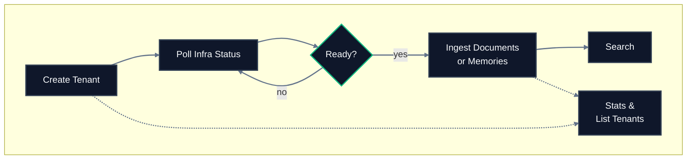

## Lifecycle



## Endpoint reference

| Endpoint | Method | SDK method | Purpose | Async? |
|---|---|---|---|---|
| `/tenants` | `POST` | `tenants.create` | Create a new isolated workspace | Yes |
| `/tenants` | `GET` | `tenants.list` | List all tenants for the organization | No |
| `/tenants` | `DELETE` | `tenants.delete` | Permanently remove a tenant | Yes |
| `/tenants/status` | `GET` | `tenants.status` | Check provisioning readiness | No |
| `/tenants/sub-tenants` | `GET` | `tenants.sub_tenants` | List active sub-tenants | No |
| `/tenants/stats` | `GET` | `tenants.stats` | Get object counts and vector dimensions | No |

## Typical call sequence

For a new tenant from scratch:

```
1. POST   /tenants             -> returns accepted
2. GET    /tenants/status      -> wait for provisioning
3. POST   /source/ingest       -> start ingesting data
4. POST   /search              -> query your data
5. GET    /tenants/stats       -> verify storage
```

For routine operations on an existing tenant:

```
GET /tenants             -> list tenants in the org
GET /tenants/sub-tenants -> list active sub-tenants
GET /tenants/stats       -> check storage growth
```

For teardown:

```
DELETE /tenants -> schedule deletion (irreversible)
```

## Key concepts

**Tenant** - Top-level isolated workspace. One per organization in most cases.

**Sub-tenant** - Subdivision inside a tenant. Created automatically the first time a `sub_tenant_id` is used. No explicit creation step, no confirmation.

**Default sub-tenant** - Every tenant gets one at creation. API calls that omit `sub_tenant_id` target this default.

**Tenant metadata schema** - Immutable field definitions set at creation. Cannot be changed later.

## Related sections

- [Essentials - Multi-Tenant Support](/essentials/multi-tenant) - concepts, isolation guarantees, use cases
- [Essentials - Metadata](/essentials/metadata) - tenant and document metadata
- [API Reference v2 - Sources](/api-reference/v2/endpoint/sources-overview) - after tenant setup, start ingesting
