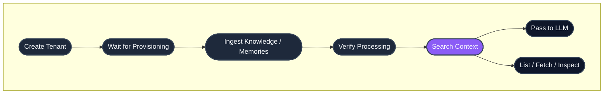

## Quick links

- **New to HydraDB?** Start with the [Quickstart](/quickstart)
- **Prefer SDKs?** See the [Python and TypeScript SDKs](#sdks) below
- **Authentication:** Every endpoint requires `Authorization: Bearer <your_api_key>`
- **Base URL:** `https://api.hydradb.com`
- **Errors:** See [Error Responses](/api-reference/error-responses)

## Endpoint groups

| Group | What it does | Pages |
|---|---|---|
| [Tenants](/api-reference/v2/endpoint/tenants-overview) | Create, monitor, and manage isolated workspaces | 6 endpoints |
| [Sources](/api-reference/v2/endpoint/sources-overview) | Ingest, list, fetch, delete, and inspect knowledge or memories | 6 endpoints |
| [Search](/api-reference/v2/endpoint/search-overview) | Retrieve context with hybrid, text, or vector search | 1 endpoint |

## End-to-end lifecycle



## SDKs

HydraDB publishes official SDKs for Python and TypeScript/Node. They wrap every endpoint in this reference with typed methods and IDE autocomplete.

| Language | Package | Install |
|---|---|---|
| **Python** | [`hydradb-sdk` on PyPI](https://pypi.org/project/hydradb-sdk/) | `pip install hydradb-sdk` |
| **TypeScript / Node** | [`@hydradb/sdk` on npm](https://www.npmjs.com/package/@hydradb/sdk) | `npm install @hydradb/sdk` |

**Quick init:**

<CodeGroup>

```python Python
import os
from hydra_db import HydraDB, AsyncHydraDB

client = HydraDB(token=os.environ["HYDRA_DB_API_KEY"])
async_client = AsyncHydraDB(token=os.environ["HYDRA_DB_API_KEY"])
```

```typescript TypeScript
import { HydraDBClient } from "@hydradb/sdk";

const client = new HydraDBClient({
  token: process.env.HYDRA_DB_API_KEY,
});
```

</CodeGroup>

SDK methods mirror the API: `client.<group>.<method>()` maps to the corresponding endpoint. v2 operations include Fern SDK fields in [`api-reference/v2/openapi.json`](/api-reference/v2/openapi.json), and the `ts-sdk-v2`, `python-sdk-v2`, and `go-sdk-v2` generators filter to audience `v2` and set `API-Version: 2` automatically.

## Full endpoint inventory

### Tenants

| Endpoint | Method | SDK method | Purpose |
|---|---|---|---|
| `/tenants` | `POST` | `tenants.create` | Create a tenant |
| `/tenants` | `GET` | `tenants.list` | List tenants |
| `/tenants` | `DELETE` | `tenants.delete` | Delete a tenant |
| `/tenants/status` | `GET` | `tenants.status` | Check provisioning readiness |
| `/tenants/sub-tenants` | `GET` | `tenants.sub_tenants` | List active sub-tenants |
| `/tenants/stats` | `GET` | `tenants.stats` | Get object counts and vector dimensions |

### Sources

| Endpoint | Method | SDK method | Purpose |
|---|---|---|---|
| `/source/ingest` | `POST` | `source.ingest` | Ingest knowledge or memories |
| `/source/status` | `GET` | `source.status` | Check processing status |
| `/source/fetch` | `GET` | `source.fetch` | Retrieve original source content or presigned URL |
| `/source/list` | `POST` | `source.list` | Paginated browse of knowledge or memories |
| `/source` | `DELETE` | `source.delete` | Delete sources or memories |
| `/source/relations` | `GET` | `source.relations` | Inspect entity relationships for a source |

### Search

| Endpoint | Method | SDK method | Purpose |
|---|---|---|---|
| `/search` | `POST` | `search.query` | Unified search over knowledge, memories, or both |

## Conventions

**Authentication.** Every endpoint requires `Authorization: Bearer <your_api_key>` in the request header. Get your key at [app.hydradb.com](https://app.hydradb.com).

**Versioning.** Send `API-Version: 2` with every v2 request.

```bash
curl -X POST 'https://api.hydradb.com/search' \
  -H "Authorization: Bearer <your_api_key>" \
  -H "API-Version: 2" \
  -H "Content-Type: application/json" \
  -d '{
    "tenant_id": "my_first_tenant",
    "query": "What are the pricing tiers?",
    "source": "sources",
    "search_by": "hybrid"
  }'
```

**Response envelope.** JSON responses from v2 routes are wrapped in a consistent envelope:

```json
{
  "success": true,
  "data": {},
  "error": null,
  "meta": {
    "request_id": "request-id",
    "latency_ms": 12.3
  }
}
```

Errors use the same envelope with `success: false`, `data: null`, and an `error` object containing `code` and `message`.

**Tenant scoping.** Every endpoint requires a `tenant_id`. Most endpoints also accept an optional `sub_tenant_id` for finer-grained scoping. If omitted, the default sub-tenant is used.

**Async operations.** Tenant creation, deletion, and content ingestion are asynchronous. They return immediately after queuing. Use the relevant status endpoint to confirm completion before downstream operations.

**Pagination.** Listing endpoints (`/source/list`) return pagination fields for browsing large result sets.

**Parameter casing.** The REST API uses snake_case (`tenant_id`). The TypeScript SDK accepts the same snake_case keys; method names are camelCase when generated for TypeScript. The Python SDK uses snake_case throughout.

**Search modes.** `POST /search` supports `search_by: "hybrid"`, `"text"`, or `"vector"` and `source: "sources"`, `"memories"`, or `"all"`.

**Status codes.** Successful responses return `200` (or `202` for async accepts). Errors follow standard HTTP semantics:

| Code | Meaning |
|---|---|
| `200` | Success |
| `202` | Accepted (async operation queued) |
| `400` | Invalid parameters |
| `401` | Authentication required |
| `403` | Forbidden |
| `404` | Resource not found |
| `409` | Conflict (e.g., tenant already exists) |
| `422` | Validation error |
| `429` | Rate limit exceeded |
| `500` | Internal server error |
| `503` | Service unavailable |

See [Error Responses](/api-reference/error-responses) for response shapes and error codes.

## Rate limits

Rate limits apply per API key. For production deployments, build retry logic with exponential backoff against the `429` response. Contact [founders@hydradb.com](mailto:founders@hydradb.com) for current limit values.

## Next steps

Existing v1 endpoints remain available under API Reference `1.0.0`.

- **Build something:** [Quickstart](/quickstart) walks through your first integration in five minutes
- **Understand the model:** [Core Concepts](/core-concepts) explains tenants, memories, recall, and metadata
- **Go deeper:** [Essentials](/essentials) covers each primitive in depth
- **Install an SDK:** [Python](https://pypi.org/project/hydradb-sdk/) · [TypeScript](https://www.npmjs.com/package/@hydradb/sdk)
